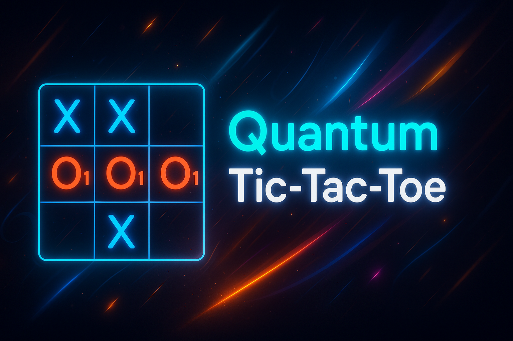

# ♾️ Quantum Tic-Tac-Toe ♾️

**Quantum Tic-Tac-Toe** is not your regular tic-tac-toe game — it's a quantum-powered, ultra-futuristic game with animated gate simulations, AI mode, and verification via quiz questions! 🌌⚛️

---

## 🚀 Features

- 🔮 **Quantum Gate Animation** – Visualize Hadamard, CNOT, X, and Z gates in action.
- 🧠 **AI Mode** – Play against a smart bot with futuristic logic.
- ❓ **Quantum Verification Quiz** – Test your basic quantum computing knowledge with randomized MCQ questions.
- 🧑‍🤝‍🧑 **Player Names & Score Tracking** – Customize names and keep track of wins, losses, and draws.
- ⚛️ **Manual Collapse & Theme Toggle** – Collapse logic and switch between light/dark themes.
- 🌌 **Particle Background & Glowing UI** – Full animated interface with particle effects and neon visuals.
- 🎙️ **Voice Input (Optional)** – Answer quiz questions with your voice (via Web Speech API).
- 📘 **Learn More** – Direct links to helpful quantum learning resources.

---

## 🧬 Technologies Used

- HTML5, CSS3, JavaScript (Vanilla)

- SVG Animations (Quantum Gates)

- tsParticles for glowing particle background

- canvas-confetti for win fireworks

- SpeechRecognition API (Web Speech)

- Responsive Design (Desktop + Mobile)

---

## 🖼️ Preview



---

## 📂 Folder Structure

Quantum-Tic-Tac-Toe/

│

├── index.html # Main HTML

├── style.css # Glowing UI, animations, particle styling

├── script.js # Game logic, AI mode, quiz logic

├── chill_music.mp3 # Background music (optional)

├── Banner.png # Intro banner


---

## 🛠️ Setup Instructions

1. **Clone the Repository**
   ```bash
   git clone https://github.com/shreyaskharat19/quantum-tic-tac-toe.git
   cd quantum-tic-tac-toe

2. **Open The Game**
   Just open index.html in your browser. No server needed!
